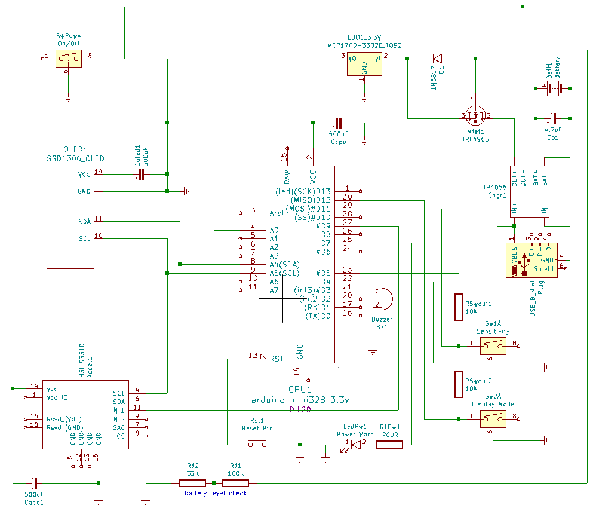

Karatemeter
===========


- [Karatemeter](#karatemeter)
  * [Warnings](#warnings)
  * [How it works](#how-it-works)
    + [Parts](#parts)
      - [Control Box](#control-box)
        * [Battery](#battery)
      - [Sensor](#sensor)
      - [Wire](#wire)
    + [Settings](#settings)
      - [Sensitivity](#sensitivity)
      - [Display Mode](#display-mode)
  * [Usage](#usage)
    + [Calibration](#calibration)
    + [Working](#working)
    + [Acceleration measurement](#acceleration-measurement)
    + [Playing ideas](#playing-ideas)
      - [Training: attach the sensor to your body](#training--attach-the-sensor-to-your-body)
      - [Playing a game: attach the sensor to a target](#playing-a-game--attach-the-sensor-to-a-target)
  * [Software](#software)
  * [Do it yourself](#do-it-yourself)
    + [Components](#components)
    + [Arduino](#arduino)
  * [押忍!](#---)
  * [License](#license)
  * [Author](#author)

Karatemeter is a device to measure the acceleration of punching or kicking.

The score is measured by "g", the acceleration of gravity 9.8 (m/s2) or the 
strength of the gravitational field (N/kg).

This project is hosted on [https://github.com/westial/karatemeter](https://github.com/westial/karatemeter)

## Warnings ##

**Carefully read the [additional document about the precautions of the lithium 
battery based devices](doc/LithiumIonBatterySafety.pdf) before
turning on the Karatemeter.**

This is a "I got fun" project with no warranty for safety. If you are going to
use whole or parts of this content you have to take the maximum safety measures.

I hardly tested the result by letting all night long connected, consuming,
stressing the processes, etc. I always did it putting the devices inside an
isolated and fireproof container. 

## How it works ##

[Quickstart](doc/Quickstart.pdf) is a document for fastly play with it.

### Parts ###


Karatemeter system is provided in three pieces.

* Control Box.
* Sensor.
* Wire.

#### Control Box ####

The Control Box contains most of the hardware. This box is not as resistant as 
the Sensor, handle it carefully.

The Control Box has the switch for powering on and off, the OLED display and the 
settings control panel as well.


1. Power on/off Switch.
2. 128x32 Display.
3. Reset Button.
4. Sensitivity Setting Switch.
5. Display Mode Setting Switch.
6. Critical battery level Led.
7. Micro USB charging port.

The Arduino based microcontroller has an open port for FTDI cable to update the 
firmware.

##### Battery #####


At the bottom of the box there is a replaceable 18650 lithium battery, and a load 
sharing power circuit that allows to charge the battery while safely using the 
Karatemeter.

If the battery gets totally discharged it can lock the power charging/loading
remove a few seconds and put in again the battery if it happens.

**When you put back the battery carefully set the positive and negative poles as 
expected. Reversing the polarity can damage the device and eventually the 
battery can catch fire.**

The charger supports Micro USB cable. Karameter works with and without battery
when the Micro USB cable is feeding the power.

When the battery is charging the charger turns on a red color light and when the
battery is fully charged the light becomes blue. There is no light when the 
USB cable is disconnected.


The following pictures is the sequence steps to remove the battery.
The battery is surrounded by a thin plastic band to make extraction easier.
The grey cover tape of the first picture is absolutely required to avoid 
shorting the display module and the microcontroller one.


If the battery level gets 0% the display turns off, and a red light on the right
corner of the Control Box interface turns on while a beep sound at intervals of 
several seconds.


It is very important to turn off the Karatemeter when it is not in use, and if
the Karatemeter is not used regularly is totally recommended removing the 
battery to safely store it.

#### Sensor ####


The high-g accelerometer sensor remains inside a protection shield attached on a 
long hard wristband with Velcro closure. It can be tied around an arm, a leg and 
on a target as wide as the band reaches.

#### Wire ####

5-channel wire goes from the Sensor to the Control Box. The wire ends are 
pluggable but there is a plastic bracket overall to protect from jerks. 

The wire must not be so tensed from the Control Box to the Sensor because it 
could accidentally disconnect the ends. It does not have to be very loose 
because it can be hooked.

The excess cable can be folded into the front of the Control Box.

The wire endings are painted in 4 different colors to avoid a misconnection,
because a misconnection could damage the device and again, it could catch fire.
Joint only the ends with the same color by the same side of the color: blue-blue, 
yellow-yellow, green-green, red-red.


If the painted colors are gone by the time, the rule to connect the wires is
quite easy. Look at the white, red and black wires. There are two connectors in
every end, box and sensor. One connector has three cables: white, red and black, 
the other one has only two: white and red. The right connection is to match them
all: 3-cable as red-red, white-white and black-black; 2-cable as red-red, 
white-white.

### Settings ###


Karatemeter have two configurable settings:

* Sensitivity.
* Display Mode.

**IMPORTANT: To change the settings, move the switches and after push the RESTART 
button, or change the settings before to turn on the Karatemeter.**

#### Sensitivity ####

The SOFT Sensitivity setting:

* The sensor limit is 100g, and it is more accurate in return.
* The sensor is sensible of softer hits, from 4g approx.

The HARD Sensitivity setting:

* The sensor limit is 200g.
* The sensor is sensitive only of harder hits, from 8g approx.

#### Display Mode ####


The BAR Display Mode consists on displaying a bar chart with one bar for
every hit, or an empty space in case of timeout.

In the BAR Display Mode the number of the top left corner is the maximum value 
of the hits currently displayed, and that's the tallest bar. 


When the tallest bar disappears by the left for the automatic scrolling, the 
next tallest bar will reach the top (dotted red line in picture), and all bars 
are scaled up. When a new hit is taller than the current in display the bars
are scaling down because the last hit will reach the top.

The RECORD Display Mode shows the *last* hit score, and maximum *record* score 
since the Karatemeter has turned on or restarted. A new best hit record is
celebrated by a special beep and the *record* blinks.

## Usage ##

### Calibration ###

When the Karatemeter starts, keep the sensor motionless for a few seconds for 
calibration of the axes. If the sensor is moved during the calibration, the
session hit scores will be corrupted, it has to be restarted.

### Working ###

The sensor is configured to ignore the hits under the minimum value of sensitivity.
The sensor has 2 states: waiting for a hit and rendering the score.

While it is waiting for a hit, if it gets an acceleration over the minimum 
sensitivity and later the acceleration decreases, it detects that there has been
a hit, and automatically ends the waiting state and renders the new score.

If the sensor does not get a valid hit after 10 seconds during the waiting, it 
renders the display with the score as 0.

The rendering score state is highlighted with a continuous beep sound. Any 
acceleration during this beep is ignored.

The following graph illustrates the behavior described above:


### Acceleration measurement ###

See the following picture. The hit direction is the red line that crosses the 
rectangular prism. The accelerometer reads the x, y and z accelerations, so 
by using the pythagorean formula the Karatemeter impact library calculates the
length of the red line, the hit.

This method is not so accurate when the hit is not totally straight, but it does 
the job most of the time.


### Playing ideas ###

Two ideas about how to use this device:

1. Training: Attaching the sensor to the arm or the leg of the person doing the action.
2. Playing a game: Attaching the sensor to a Makiwara (巻藁), a punching bag or mannequin.

#### Training: attach the sensor to your body ####


The sensor is tied on the wrist or on the ankle in case of kicking measurement.
The Control Box can hang from the belt, and the wire passes along inside or 
outside the suite. In the package there are a rubber band to tie the loose wire,
it doesn't have to hang.

The maximum value that the sensor can read is in this way, a human can punch up 
to 200g of acceleration by 10 milliseconds. The HARD Sensitivity setting
is recommended for an adult user.

It can be helpful for self training, the display in the Control Box is facing
up to allow the user to follow up the scoring.

#### Playing a game: attach the sensor to a target ####


In this way the sensor is attached to a Makiwara, mannequin, punching bag, or 
whatever the hits make it move. Place the sensor in behind the target to protect
from knocking.

There can be used with multiple users in a row, they can play at who hits the
hardest. The Sensitivity setting must be set to SOFT.

## Software ##

All source code but the located into [arduino/](arduino/) directory is abstracted
from an specific device. So it can be used as library for other systems than 
Arduino. This source code is a C static Library for an accelerator based sensor 
to measure the score of a movement, a punch, a kick, the regression of a 
punching bag, etc.

It is created from TDD based on the book "Test-Driven Development for Embedded C"
written by the great [James W. Grenning](https://wingman-sw.com/). I'm so sorry
if I didn't follow all the principles and learning, at the last phase of this 
development I was a little hurry up. Although I left it open for continuing 
on refactoring and so on.

The tests are handled by the library [CppUTest](https://cpputest.github.io/),
also following the guidelines from the book mentioned above and the documentation
in the official page of the library.

Thanks very much to Davis Ford too, for the [test setup scaffold of CppUTest](https://github.com/davisford/cmake-cpputest).

I found a very helping documentation about using an accelerometer for punching
measurement here [Abieneman Makiwara punching sensor](https://abieneman.wordpress.com/2010/04/04/punch-acceleration-sensor/)

## Do it yourself ##

The final result of this project is an Arduino based device with the following 
schema.



### Components ###

* OLED SSD1306 128x32 display.
* 18650 lithium battery.
* TP4056 USB Charger with protection circuit.
* IRF4905 P-Channel MOSFET for load sharing circuit.
* 1N5817 schottky diode for load sharing circuit.
* MCP1700-3302E-TO92 LDO regulator to reduce voltage to 3.3V.
* [H3LIS331DL High-g 3-axis accelerometer](https://learn.sparkfun.com/tutorials/h3lis331dl-accelerometer-breakout-hookup-guide/all). 
  I really owe a beer to the [Sparkfun developers](https://github.com/sparkfun/SparkFun_LIS331_Arduino_Library). 
* Arduino Pro Mini 328 3.3V 8MHz, my best partner.
* Buzzer, led, resitors, capacitors, wires, buttons, switches,... See the schema.

### Arduino ###

The directory [arduino](arduino) contain the script to prebuild the files needed
for the Arduino installation and maintenance as well.

To generate the Arduino sketch as you can open in your IDE go in and ask for
install.

```
cd ./arduino
make install
```

The above command generated the directory [arduino/prebuild](arduino/prebuild),
inside this directory there is the sketch subdirectory 
[arduino/prebuild/karatemeterino](arduino/prebuild/karatemeterino). Also there
is a directory named [arduino/prebuild/Karatemeter](arduino/prebuild/Karatemeter)
that's the Arduino Library required for the sketch. Move this [arduino/prebuild/Karatemeter](arduino/prebuild/Karatemeter)
to your Arduino libraries location.

## 押忍! ##

Special thanks to [Tenshi Dojo (空手道 天志道場)](https://tenshidojo.jp/) and the great group of 
Saturday's classmates to let me learn and enjoy Karate with them 
despite my elemental Japanese level. I made this project as a present for the 
25th anniversary of this Dojo to thank them all the friendly welcoming.

## License ##

GNU General Public License (GPLv3). Read the attached [license file](LICENSE.txt).

## Author ##

Jaume Mila Bea <jaume@westial.com>